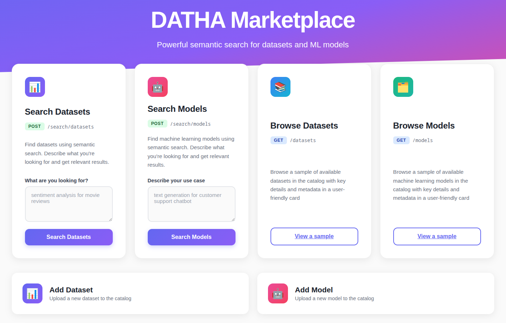
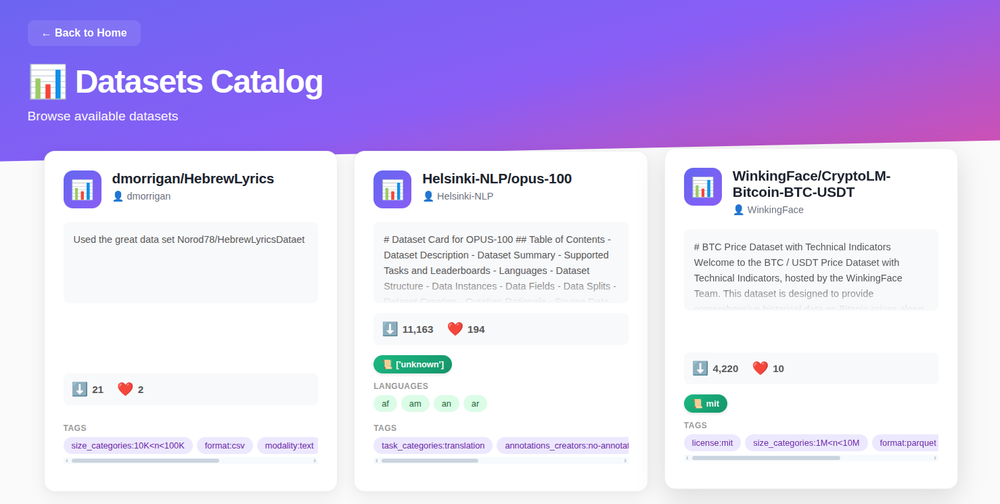
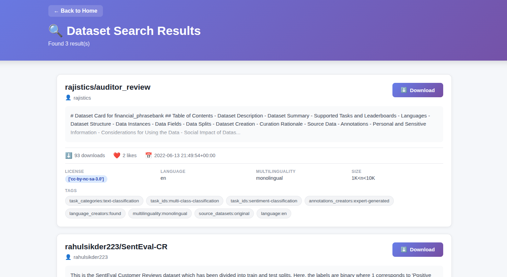

# DATHA Marketplace

A Retrieval-Augmented Generation (RAG) system for semantically searching HuggingFace datasets and models using embeddings, with vector storage [**Qdrant**](https://qdrant.tech/documentation/overview/) and object storage [**MinIO**](https://charts.min.io/).



---

## 📋 Overview

This project provides a web-based search interface that allows users to:
- **Search** datasets and models using natural language queries with semantic similarity
- **Add** new datasets and models to the catalog (MinIO + Qdrant)
- **View** catalog samples and search results
- Use **transformer-based embeddings** for accurate content matching
- Optionally apply **LLM filtering** for relevance refinement

---

## 🏗️ Architecture

```
┌─────────────┐
│ User Query  │
└──────┬──────┘
       │
       v
┌─────────────────┐
│Embedding Service│ (Jina v3 embeddings)
└──────┬──────────┘
       │
       v
┌──────────────────┐
│  Qdrant Search   │ (Vector similarity)
└──────┬───────────┘
       │
       v
┌──────────────────┐
│ MinIO Retrieval  │ (Object storage)
└──────┬───────────┘
       │
       v
┌──────────────────┐
│   LLM Filter     │ (Optional - Llama 3.2)
└──────┬───────────┘
       │
       v
┌──────────────────┐
│    Results       │
└──────────────────┘
```

**Key Components:**
- **FastAPI** - Web framework for API endpoints
- **Qdrant** - Vector database for embeddings
- **MinIO** - Object storage for metadata
- **Jina Embeddings v3** - Text embedding model
- **Llama 3.2** - Optional LLM for relevance filtering

---

## 🚀 Getting Started

### Prerequisites

- **Docker** and **Docker Compose** (recommended)
- **OR** Python 3.8+ with pip (manual setup)
- (Optional) CUDA-enabled GPU for faster inference
- HuggingFace API token (for LLM filtering)

---

## 🐳 Docker Setup (Recommended)

### 1. Clone the Repository

```bash
git clone <repository-url>
cd DigitalTwins-API
```

### 2. Prepare Data Files

Ensure your `data/` directory contains:
- `data.zip` file

It will be unzipped automatically by the entrypoint script.

### 3. Start Services with Docker Compose

```bash
# Build and start all services (FastAPI, MinIO, Qdrant)
docker-compose up --build

# Or run in detached mode (background)
docker-compose up -d --build
```

**Services will be available at:**
- **API**: http://localhost:8000
- **MinIO Console**: http://localhost:9001 (login: `minioadmin` / `minioadmin`)
- **Qdrant Dashboard**: http://localhost:6333/dashboard

### 5. Populate Data (One-Time Setup)

After services are running, populate MinIO and Qdrant with your CSV data:

```bash
# If running in Docker
docker-compose exec api python -m src.populate_data

# Or if running locally
python -m src.populate_data
```

This script reads the CSV files and populates both storage systems.

### 6. Access the Application

Open your browser and navigate to:
- **Home**: http://localhost:8000
- **API Docs**: http://localhost:8000/docs

---

## 💻 Manual Setup (Without Docker)

### 1. Install Dependencies

```bash
python -m venv venv
source venv/bin/activate  # Linux/Mac
# or
venv\Scripts\activate  # Windows

pip install -r requirements.txt
```

### 2. Start External Services

**Option A: Use Docker for MinIO and Qdrant only**

```bash
# Start just MinIO and Qdrant
docker-compose up minio qdrant -d
```

**Option B: Install and run locally**

- **MinIO**: https://min.io/download
- **Qdrant**: https://qdrant.tech/documentation/quick-start/

### 3. Configure Environment

Update `.env` for local services:

```env
MINIO_ENDPOINT=localhost:9000
QDRANT_HOST=localhost
QDRANT_PORT=6333
```

### 4. Populate Data

```bash
python -m src.populate_data
```

### 5. Start the API

```bash
uvicorn src.main:app --reload --host 0.0.0.0 --port 8000
```

---

## 📖 Using the Application

### Web Interface

#### 1. View Catalog Samples

**Datasets:**
- Navigate to http://localhost:8000/datasets
- Shows 10 random datasets from MinIO

[](templates/img/datasets_catalog.png)

**Models:**
- Navigate to http://localhost:8000/models
- Shows 10 random models from MinIO

#### 2. Search Datasets or Models

1. Go to http://localhost:8000/
2. Enter a natural language query (e.g., "sentiment analysis dataset in English" or "text generation model")
3. Click "Search"
4. View results ranked by semantic similarity

[](templates/img/dataset_search_result.png)


### API Endpoints

#### Datasets

**Get Sample:**
```bash
GET http://localhost:8000/datasets
```

**Search:**
```bash
POST http://localhost:8000/search/datasets
Content-Type: application/x-www-form-urlencoded

description=sentiment analysis
```

**Add Dataset:**
```bash
POST http://localhost:8000/datasets/add
Content-Type: application/x-www-form-urlencoded

dataset_id=my-sentiment-dataset
```

#### Models

**Get Sample:**
```bash
GET http://localhost:8000/models
```

**Search:**
```bash
POST http://localhost:8000/search/models
Content-Type: application/x-www-form-urlencoded

description=text generation model
```

**Add Model:**
```bash
POST http://localhost:8000/models/add
Content-Type: application/x-www-form-urlencoded

model_id=my-gpt-model
```

---

## 🔧 Configuration

### Environment Variables

| Variable | Default | Description |
|----------|---------|-------------|
| `HUGGINGFACE_API_TOKEN` | - | Required for LLM filtering |
| `EMBEDDING_DEVICE` | `cpu` | `cpu`, `cuda`, or `auto` |
| `LLM_DEVICE` | `cpu` | `cpu`, `cuda`, or `auto` |
| `DEFAULT_TOP_K` | `3` | Number of search results |
| `USE_LLM_FILTER` | `false` | Enable LLM relevance filtering |
| `MINIO_ENDPOINT` | `localhost:9000` | MinIO server address |
| `QDRANT_HOST` | `localhost` | Qdrant server address |

### GPU Acceleration

To use GPU (requires CUDA):

```env
EMBEDDING_DEVICE=cuda
LLM_DEVICE=cuda
```

Or use auto-detection:

```env
EMBEDDING_DEVICE=auto
LLM_DEVICE=auto
```

---

## 📁 Project Structure

```
DigitalTwins-API/
├── data/                           # CSV files with embeddings
│   ├── data.zip
├── src/
│   ├── main.py                     # FastAPI application
│   ├── config.py                   # Configuration settings
│   ├── dependencies.py             # Dependency injection
│   ├── populate_data.py            # Data population script
│   ├── models/
│   │   └── schemas.py              # Pydantic models
│   └── services/
│       ├── rag.py                  # RAG pipeline
│       ├── datasets.py             # Dataset business logic
│       ├── models.py               # Model business logic
│       ├── storage.py              # MinIO storage service
│       └── vectordb.py             # Qdrant vector DB service
├── templates/                      # HTML templates
│   ├── index.html
│   ├── add_dataset.html
│   ├── add_model.html
│   ├── datasets.html
│   ├── models.html
│   ├── results_dataset.html
│   └── results_model.html
├── docker-compose.yaml             # Docker services configuration
├── Dockerfile                      # API container definition
├── requirements.txt                # Python dependencies
├── readme.md                       # This file
├── entrypoint.sh                   # Docker entrypoint script
├── example.http                    # API testing examples
└── test_main.http                  # API testing examples
```

---

## 🧹 Maintenance

### View MinIO Data

Access MinIO Console at http://localhost:9001

**Credentials:** `minioadmin` / `minioadmin`

**Buckets:**
- `datasets` - Dataset metadata and embeddings
- `models` - Model metadata and embeddings

**Structure:**
```
datasets/
  author/dataset_id/
    metadata.json
    embedding.npy

models/
  author/model_id/
    metadata.json
    embedding.npy
```

### View Qdrant Data

Access Qdrant Dashboard at http://localhost:6333/dashboard

**Collections:**
- `datasets` - Dataset embeddings (1024-dim)
- `models` - Model embeddings (1024-dim)

### Clear All Data

```bash
# Stop services
docker-compose down

# Remove volumes (deletes all data)
docker-compose down -v

# Restart and repopulate
docker-compose up -d --build
docker-compose exec api python -m src.populate_data
```

---

## ⚠️ Troubleshooting

### Services Won't Start

**Check logs:**
```bash
docker-compose logs -f
```

**Common issues:**
- Port conflicts (8000, 9000, 9001, 6333)
- Insufficient disk space
- Docker daemon not running

### Empty Search Results

**Possible causes:**
1. Data not populated - run `python -m src.populate_data`
2. Wrong endpoint configuration in `.env`
3. MinIO buckets empty - check console at http://localhost:9001
4. Qdrant collections empty - check dashboard at http://localhost:6333/dashboard

### CUDA Out of Memory

```env
EMBEDDING_DEVICE=cpu
LLM_DEVICE=cpu
```

### Slow Performance

**Optimizations:**
1. Reduce `DEFAULT_TOP_K` (e.g., from 10 to 3)
2. Disable LLM filtering: `USE_LLM_FILTER=false`
3. Use GPU: `EMBEDDING_DEVICE=cuda`
4. Use smaller embedding model in `config.py`

---

## 🧪 Testing

### Using test_main.http

Use HTTP client tools (PyCharm HTTP Client, VS Code REST Client):

```http
### Get datasets sample
GET http://localhost:8000/datasets

### Search datasets
POST http://localhost:8000/search/datasets
Content-Type: application/x-www-form-urlencoded

description=sentiment analysis dataset
```

### Manual Testing

```bash
# Test health
curl http://localhost:8000/

# Add dataset
curl -X POST "http://localhost:8000/datasets/add" \
  -H "Content-Type: application/x-www-form-urlencoded" \
  -d "dataset_id=test-dataset-123"

# Search
curl -X POST "http://localhost:8000/search/datasets" \
  -H "Content-Type: application/x-www-form-urlencoded" \
  -d "description=sentiment analysis"
```

---

## 🛑 Stopping the Application

```bash
# Stop services
docker-compose down

# Stop and remove volumes (deletes all data)
docker-compose down -v
```
