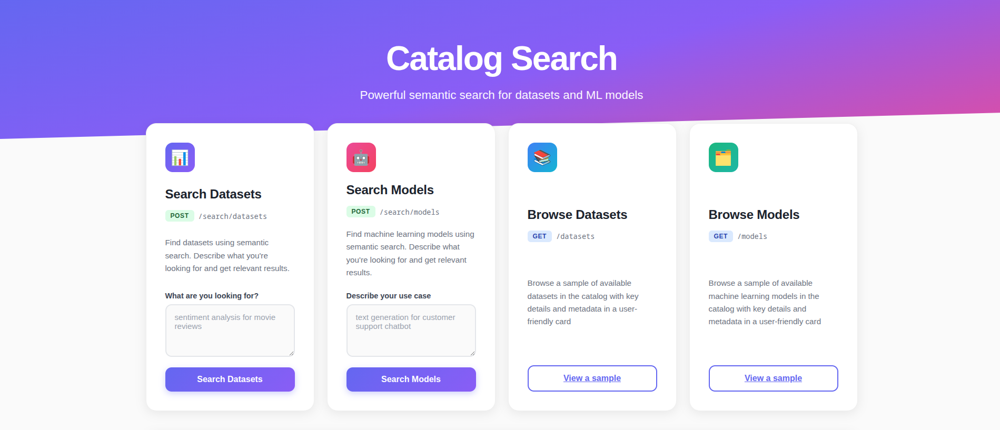

# Catalog Search API for the DigitalTwins project

A Retrieval-Augmented Generation (RAG) system for semantically searching HuggingFace datasets and models using embeddings and optional LLM filtering.



## 📋 Overview

This project provides a web-based search interface that allows users to:
- Search through HuggingFace datasets and models using natural language queries
- Add new datasets and models to the catalog
- View search results ranked by semantic similarity
- Leverage transformer-based embeddings for accurate content matching

## 🏗️ Architecture

```
┌─────────────┐
│ User Query  │
└──────┬──────┘
       │
       v
┌─────────────────┐
│Embedding Service│ (Converts text to vectors)
└──────┬──────────┘
       │
       v
┌──────────────────┐
│Similarity Ranker │ (Finds top-K matches)
└──────┬───────────┘
       │
       v
┌──────────────────┐
│   LLM Filter     │ (Optional refinement)
└──────┬───────────┘
       │
       v
┌──────────────────┐
│    Results       │
└──────────────────┘
```

## 🚀 Getting Started

### Prerequisites

- Python 3.8+
- pip package manager
- (Optional) CUDA-enabled GPU for faster inference
- HuggingFace API token (for LLM filtering)

### Installation

**1. Clone the repository**

```bash
git clone <repository-url>
cd DigitalTwins-API
```

**2. Create a virtual environment (recommended)**

```bash
python -m venv venv
source venv/bin/activate  # On Linux/Mac
# or
venv\Scripts\activate  # On Windows
```

**3. Install dependencies**

```bash
pip install -r requirements.txt
```

**4. Verify data files exist**

Ensure your data directory contains the CSV files:
- `data/datasets_hg_embeddings_sm.csv`
- `data/models_hg_embeddings_sm.csv`

**5. Start the application**

```bash
uvicorn src.main:app --reload --host 0.0.0.0 --port 8000
```

The application will be available at:
- **Web Interface**: http://localhost:8000
- **API Documentation (Swagger)**: http://localhost:8000/docs
- **ReDoc**: http://localhost:8000/redoc

## 📖 Tutorial

### 1. Accessing the Web Interface

Navigate to `http://localhost:8000` in your browser. You'll see the home page with options to search and manage datasets and models.

### 2. Viewing Catalogs

**View Datasets:**
- Navigate to http://localhost:8000/datasets
- Displays a random sample of 10 datasets from your catalog

**View Models:**
- Navigate to http://localhost:8000/models
- Displays a random sample of 10 models from your catalog

### 3. Adding New Datasets

**Via API:**

```bash
curl -X POST "http://localhost:8000/datasets/add" \
  -H "Content-Type: application/x-www-form-urlencoded" \
  -d "dataset_id=my-sentiment-dataset"
```

**Response:**
```json
{
  "message": "Dataset added successfully",
  "dataset_id": "my-sentiment-dataset"
}
```

**Note**: Currently creates a mockup dataset with predefined attributes for testing.

### 4. Adding New Models

**Via API:**

```bash
curl -X POST "http://localhost:8000/models/add" \
  -H "Content-Type: application/x-www-form-urlencoded" \
  -d "model_id=my-text-generation-model"
```

**Response:**
```json
{
  "message": "Model added successfully",
  "model_id": "my-text-generation-model"
}
```

### 5. Searching Datasets

**Via API:**

Step 1: Submit search query
```bash
curl -X POST "http://localhost:8000/search/datasets" \
  -H "Content-Type: application/x-www-form-urlencoded" \
  -d "description=sentiment analysis dataset in English"
```

Returns a redirect (303) to `/search/datasets/{search_id}`

Step 2: Get results
```bash
curl -X GET "http://localhost:8000/search/datasets/{search_id}"
```

**Example Response:**
```json
{
  "results": [
    {
      "dataset_id": "imdb-reviews",
      "author": "stanford",
      "created_at": "2020-01-15",
      "readme_file": "Large movie review dataset...",
      "downloads": 15000,
      "likes": 250,
      "tags": ["sentiment", "text-classification"],
      "language": ["en"],
      "license": "apache-2.0",
      "multilinguality": ["monolingual"],
      "size_categories": ["10K<n<100K"],
      "task_categories": ["text-classification"]
    }
  ]
}
```

### 6. Searching Models

**Via API:**

```bash
# Step 1: Submit search
curl -X POST "http://localhost:8000/search/models" \
  -H "Content-Type: application/x-www-form-urlencoded" \
  -d "description=text generation model for code"

# Step 2: Get results (use search_id from redirect)
curl -X GET "http://localhost:8000/search/models/{search_id}"
```


## 🔧 Configuration

### Device Selection

Configure compute devices in `.env`:

```env
# Use CUDA if available, otherwise CPU
EMBEDDING_DEVICE="auto"
LLM_DEVICE="auto"

# Force CPU
EMBEDDING_DEVICE="cpu"
LLM_DEVICE="cpu"

# Force CUDA (requires CUDA-enabled GPU)
EMBEDDING_DEVICE="cuda"
LLM_DEVICE="cuda"
```

### Search Parameters

```env
# Number of results to return
DEFAULT_TOP_K=10

# Change embedding model
EMBEDDING_MODEL_NAME="sentence-transformers/all-MiniLM-L6-v2"

# Change LLM for filtering
LANGUAGE_MODEL_NAME="microsoft/phi-2"
```

## 📁 Project Structure

```
DigitalTwins-API/
├── src/
│   ├── main.py                 # FastAPI application & endpoints
│   ├── config.py               # Configuration management
│   ├── models/
│   │   └── schemas.py          # Pydantic models
│   └── services/
│       ├── rag.py              # RAG pipeline components
│       ├── datasets.py         # Dataset management
│       └── models.py           # Model management
├── templates/                  # Jinja2 HTML templates
│   ├── index.html
│   ├── datasets.html
│   └── models.html
├── data/
│   ├── datasets_hg_embeddings_sm.csv  # Dataset catalog
│   └── models_hg_embeddings_sm.csv    # Model catalog
├── requirements.txt            # Python dependencies
├── .env                        # Environment configuration
├── test_main.http              # HTTP test requests
└── readme.md                   # This file
```

## 🔌 API Endpoints

### Datasets

- `GET /datasets` - View datasets page (HTML)
- `POST /datasets/add` - Add a new dataset
- `POST /search/datasets` - Search datasets by description
- `GET /search/datasets/{search_id}` - Get search results

### Models

- `GET /models` - View models page (HTML)
- `POST /models/add` - Add a new model
- `POST /search/models` - Search models by description
- `GET /search/models/{search_id}` - Get search results

### General

- `GET /` - Home page
- `GET /docs` - Interactive API documentation (Swagger UI)
- `GET /redoc` - Alternative API documentation (ReDoc)

## ⚠️ Troubleshooting

### CUDA Out of Memory

**Solution**: Switch to CPU or use smaller models

```env
EMBEDDING_DEVICE="cpu"
LLM_DEVICE="cpu"
```

### Model Download Fails

**Solution**: Check internet connection and authenticate

```bash
huggingface-cli login
```

Or set your token in `.env`:
```env
HUGGINGFACE_API_TOKEN="your_token_here"
```

### Empty Search Results

**Solutions**:
1. Verify CSV files contain data with embeddings
2. Check embedding dimensions match between query and stored embeddings
3. Ensure query is relevant to catalog content
4. Check that embeddings column contains valid data

### Slow Search Performance

**Solutions**:
1. Reduce `DEFAULT_TOP_K` value (e.g., from 10 to 5)
2. Disable LLM filtering by commenting out that step in `rag.py`
3. Use GPU acceleration by setting `EMBEDDING_DEVICE="cuda"`
4. Use smaller/faster embedding models

### Import Errors

**Solution**: Ensure all dependencies are installed

```bash
pip install -r requirements.txt
```

### Port Already in Use

**Solution**: Change the port or kill the process using port 8000

```bash
# Find process using port 8000
lsof -i :8000

# Kill the process
kill -9 <PID>

# Or use a different port
uvicorn src.main:app --reload --port 8080
```

## 🧪 Testing

### Using test_main.http

The project includes a `test_main.http` file for testing endpoints. Use it with HTTP client tools like:
- JetBrains HTTP Client (built into PyCharm/IntelliJ)
- REST Client extension for VS Code

### Manual Testing

```bash
# Test health check
curl http://localhost:8000/

# Test dataset addition
curl -X POST "http://localhost:8000/datasets/add" \
  -H "Content-Type: application/x-www-form-urlencoded" \
  -d "dataset_id=test-dataset-$(date +%s)"

# Test search
curl -X POST "http://localhost:8000/search/datasets" \
  -H "Content-Type: application/x-www-form-urlencoded" \
  -d "description=sentiment analysis"
```

### Load Testing

Test multiple concurrent searches:

```bash
for i in {1..10}; do
  curl -X POST "http://localhost:8000/search/datasets" \
    -H "Content-Type: application/x-www-form-urlencoded" \
    -d "description=sentiment analysis" &
done
wait
```

